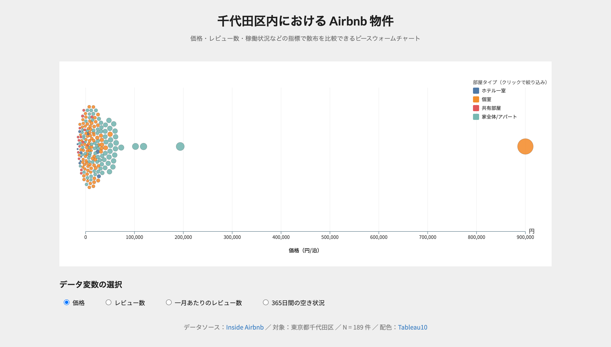

+++
author = "Yuichi Yazaki"
title = "【1日間】D3.js・基礎"
subtitle = "ウェブで動くインタラクティブな可視化を、自分の手で書けるようになる"
slug = "1day-d3"
date = "2026-04-15"
categories = [
    "course"
]
tags = [
]
image = "images/1day-d3.png"
+++

### 差し上げます

- 講習に利用したPDFファイルとサンプルコード・サンプルデータを差し上げます。
- 講習の内容を網羅したエージェント・スキルズ（Agent Skills）ファイルを差し上げます。
  - エージェント・スキルズとは、AIが特定のタスクを効率的・専門的にこなすための「拡張機能」や「専門能力」のことを指します。Claude Code、OpenAI Codex、Google Antigravity、GitHub Copilot、Cursorなどに対応しています。
  - 対応しているプロダクト一覧：[Client Showcase - Agent Skills](https://agentskills.io/clients)
- 講義の録画データをご提供します。繰り返し視聴いただくことで復習に役立てていただけます。

### こんなことを学びます

D3.js は、ウェブブラウザ上でデータを自在に可視化できる JavaScript ライブラリです。既成のチャートライブラリでは表現しきれない、独自のインタラクティブな可視化を作るための基礎を、一気通貫で学びます。

- SVG と DOM 操作の基本
- データのバインディング（data join）の考え方
- データと表現（軸や大きさ、色）をつなぐスケールの考え方
- よく使われるチャート（折れ線グラフ・ビースウォーム・プロット）を自力で書く
- マウス操作によるデータやチャートへの状態変化のさせ方

### 作れるもの（例）

自分の手でコードを書いて、以下のような静的なチャートからインタラクティブなアニメーションまで作れるようになります。

### スキルを身につけることで得られるメリット

- 既成のチャートツールでは難しい、オリジナルの可視化を実現できるようになります。
- データと画面要素の対応関係を意識できるようになり、他の可視化ツールの理解も深まります。
- ウェブ上で公開・共有しやすい成果物を作れるようになります。

### 使用するツール

D3.js、任意のテキストエディタ（Visual Studio Code 推奨）、そのほか生成AIツール（ご用意できるもの何でも構いません）

### 価格

22,000円（税込）

### 日程

隔週 第1・3日曜日



### タイムテーブル

- 10:00-11:25（85分）イントロダクション
    - JavaScript とは？
    - D3.js とは？
    - 事例を知る
    - 環境セットアップ

- 11:25-12:25（昼食休憩）

- 12:25-13:50（85分）静的チャートをつくる
    - 画面（開発環境）の使い方
    - ブロックごとのコードの読み方
    - 折れ線グラフをつくろう
    - データと表現をつなぐ「スケール」とは
    - 大きさのスケールを変更してみよう
    - カラー・スケールを変更してみよう

- 13:50-14:00（休憩）

- 14:00-15:25（85分）動的チャートをつくる
    - ビースウォーム・プロットをつくろう
    - データの追加／更新／削除パターン（enter / update / exit）
    - フォームからデータと表現を更新しよう

- 15:25-15:35（休憩）

- 15:35-17:00（85分）公開とこれから
    - レスポンシブレイアウト
    - ウェブサイトとしてアップロードして共有しよう
    - ヴァイブコーディングを取り入れよう
    - Q&A

### こんな風に教えます
少人数制で、丁寧にお教えいたします。お忙しい方でも集中的に学ぶことができます。

### ご用意いただくもの
ノートPC、インターネットブラウザ、任意のテキストエディタ（Visual Studio Code 推奨）をご用意ください。事前に最低限の HTML/CSS/JavaScript の知識があるとスムーズです。

### 定員

最大5名程度

### 会場

ZOOMを利用したオンラインでの開催です。

### ご注意

- 決済には Stripe を利用しております。
- 領収書の発行を承ります。
- オンラインによるご受講になります。環境設定については[ご案内ページ](/pages/online-participation/)を参照ください。
- ギフト購入もしていただけます（購入者と受講者が別）。ギフトという形で受講者へ送付いたします。
- 本講座で配布するスライドや動画を、受講していない第三者（同僚やご友人など）へは共有なさらないでください。

### お申し込み

以下のフォームよりお申し込みください。
お申し込み後、Stripe 決済画面へ移動します。


