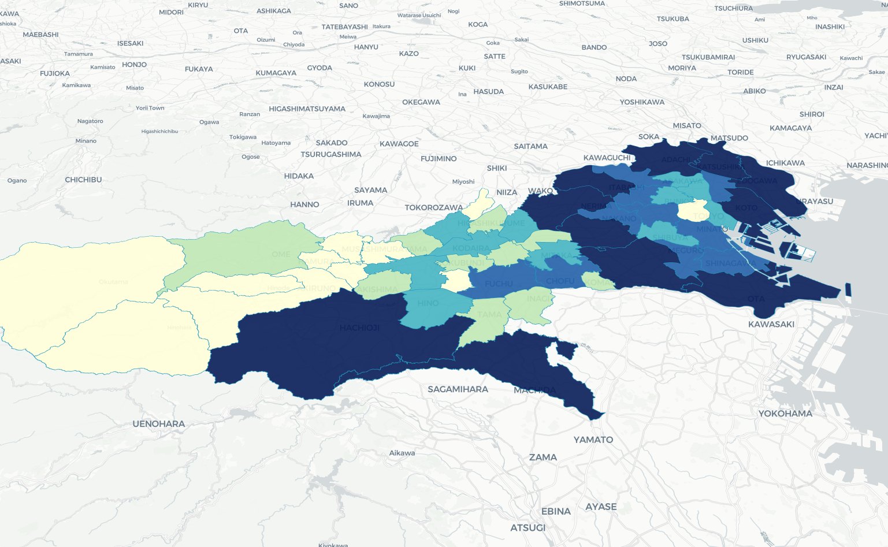
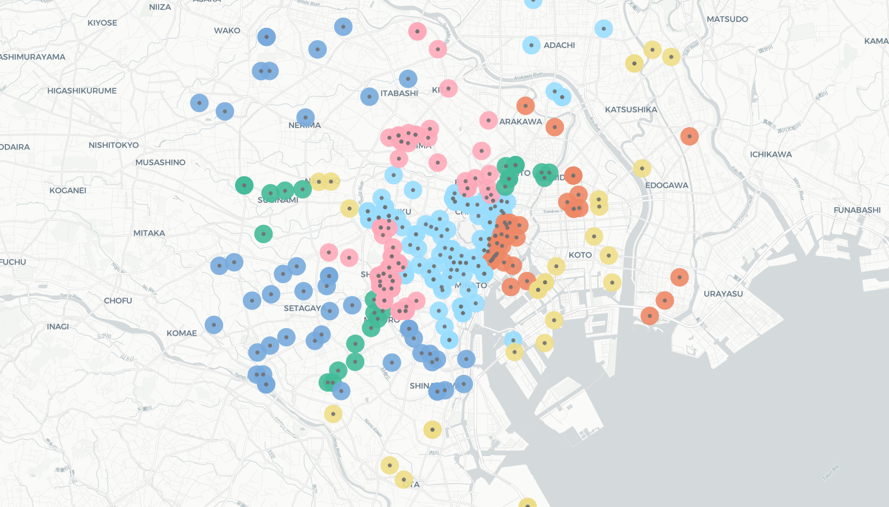
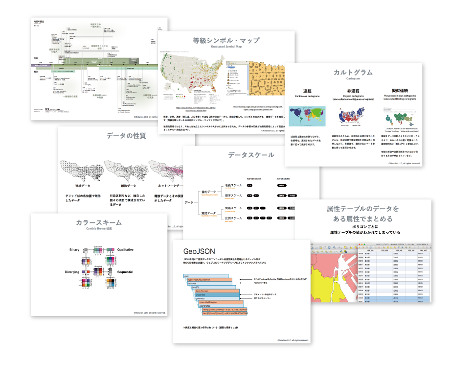

+++
author = "Yuichi Yazaki"
title = "【1日間】主題地図の可視化・基礎"
subtitle = ""
slug = "1day-map"
date = "2026-01-03"
categories = [
    "course"
]
tags = [
]
image = "images/1day-map.png"
+++

地図にデータを重ねるときの考え方と、主題地図を作るための実務手順を学ぶ1日講座です。地図表現の原理原則、ベースマップとテーマデータの関係、地理データの加工、複数ツールの使い分けをまとめて扱います。

### こんな方におすすめ

- 住所や地域別データを地図で表現したい方
- 主題地図の読み方・作り方を基礎から学びたい方
- QGIS や Web地図ツールを業務に取り入れたい方
- 地図で見せるためのデータ加工まで理解したい方

### この講座でできるようになること

- データを地図に掲載する原理原則を理解できるようになります。
- 既成の主題地図がどのような要素で構成されているか見分けられるようになります。
- 出口である地図表現から逆算して、地理データを加工できるようになります。
- 複数の地図ツールを使い分け、アウトプットの幅を広げられるようになります。

### 作るもの・扱う題材

コロプレスマップ（階級区分図）、店舗から一定距離の範囲を示す地図、3D主題地図などを扱います。座学で地図表現の仕組みを押さえたうえで、QGIS や Webアプリを使って実際にデータを加工・可視化します。

### 講座の特徴

少人数制で、地図表現の原理原則とツール操作をセットで扱います。単に地図を作るだけでなく、どのようなデータ加工が必要かを出口から逆算して考えます。

### 使用するツール・事前準備

- QGIS
- Foursquare Studio
- Mapbox
- jSTAT MAP

基本的にはノートPCとインターネットブラウザをご用意ください。

### 受講後に受け取れるもの

- 講習に利用したPDFファイルとサンプルデータを差し上げます。
- 講義の録画データをご提供します。繰り返し視聴いただくことで復習に役立てていただけます。

### 開催概要

- 価格: 22,000円（税込）
- 日程: 隔週 第2・4土曜日
- 定員: 最大5名程度
- 会場: ZOOMを利用したオンライン開催



### タイムテーブル

- 10:00-11:25（85分）
    - [座学] 主題地図とは？
    - [座学] テーマデータの種類ごとに整理する主題地図

- 11:25-12:25（昼食休憩）

- 12:25-13:50（85分）
    - [座学] ベースマップとは
    - [実習] 様々なWebアプリ紹介

- 13:50-14:00（休憩）

- 14:00-15:25（85分）
    - [実習] 地理データのクレンジングと加工（QGIS利用）
    - [実習] 住所へ緯度経度を付与

- 15:25-15:35（休憩）

- 15:35-17:00（85分）
    - [実習] 手軽に作る3D主題地図
    - Q&A

### ご注意

- 決済には Stripe を利用しております。
- 領収書の発行を承ります。
- オンラインによるご受講になります。環境設定については[ご案内ページ](/pages/online-participation/)を参照ください。
- ギフト購入もしていただけます（購入者と受講者が別）。ギフトという形で受講者へ送付いたします。
- 本講座で配布するスライドや動画を、受講していない第三者（同僚やご友人など）へは共有なさらないでください。

### お申し込み

以下のフォームよりお申し込みください。
お申し込み後、Stripe 決済画面へ移動します。決済完了をもって正式な受付となります。


