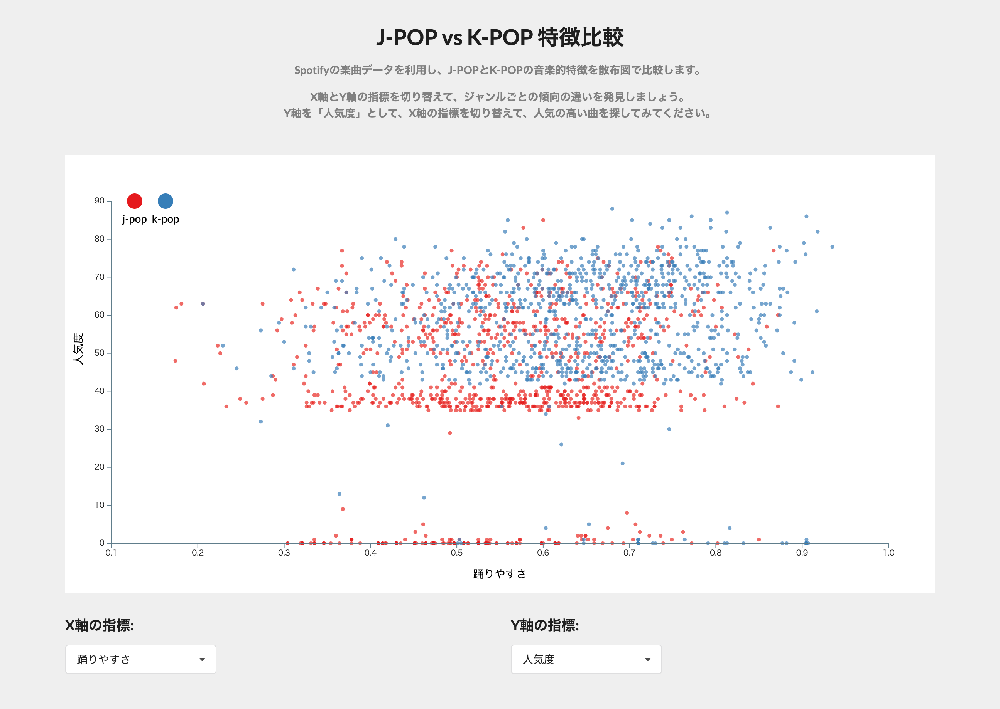

+++
author = "Yuichi Yazaki"
title = "【90分】AIコーディングでつくるインタラクティブチャート・入門"
subtitle = "対話から始めて、操作できるチャートを短時間で形にする"
slug = "ai-coding-charts"
date = "2026-05-05"
categories = [
    "course"
]
tags = [
]
image = "images/spotify_jpop_kpop.png"
summary = "初学者向けの入門講座。ChatGPT、Claude、Gemini などのコーディング支援モデルを使い、対話から始めて操作できるチャートを作ります。"
+++

本講座は、プログラミングそのものを大掛かりに学ぶのではなく、生成AIとの対話を入り口にして、コーディングでインタラクティブなチャートをつくるための入門講座です。AIに何を頼めば前に進むかを体験しながら、自分の手で成果物を作ります。

### こんなことを学びます

- AIコーディングを、可視化づくりの具体的な作業に落とし込む方法
- 会話から要件を整理し、チャートの仕様に変える考え方
- コード生成、修正、デバッグ、見た目の調整をAIに分担させる進め方
- ブラウザ上で操作できるチャートを短時間で形にする流れ

### この講座の特徴

- プログラミング初学者でも入りやすいよう、チャートづくりに焦点を絞ります。
- 「まず対話する」「小さく試す」「直して育てる」というAIコーディングの基本を体験できます。
- 完成物は見るだけでなく、操作して変化を確かめられるインタラクティブなチャートです。

### 対象

- AIコーディングをこれから試したい方
- プログラミング学習を本格的に始める前に、まずは成果物を作ってみたい方
- 業務や学習でデータを扱うことがあり、可視化を自分で調整できるようになりたい方

### 作れるもの

受講中は、Spotify の楽曲データをもとに、J-POP と K-POP の特徴を比較するインタラクティブな散布図を制作します。X軸とY軸の指標を切り替えながら、ジャンルごとの傾向の違いを見比べられるチャートです。

### 使用するツール

- ChatGPT、Claude、Gemini のうち、コーディングがサポートされたモデル
    - ChatGPT...無料、Go、Plus、Proのどれでも
    - Claude...有料プラン（Pro, Max）のどれでも
    - Gemini...無料プラン
- インターネットブラウザ
- 任意のテキストエディタ（Visual Studio Code 推奨）

### 価格

9,000円（税込）

### 日程

隔週 第1・3水曜日



### タイムテーブル

- 19:30-19:45 環境準備
    - AIにコードを書いてもらうための前提の共有
    - アプリや拡張機能などの準備

- 19:45-20:00 対話から始める
    - やりたいチャートを言葉で説明する
    - AIに要件整理を手伝ってもらう
    - 最初のたたき台を出してもらう

- 20:00-20:30 さまざまなタスクを任せつつ、AIと一緒につくる
    - コード生成
    - データの加工
    - 文言修正
    - 配色のルールを変更
    - インタラクション追加
    - デバッグ

- 20:30-20:50 アレンジしてみよう
    - テーマを決め、データのフィルタリングやチャート種別を選ぶ
    - オリジナルのチャートを作成する

- 20:50-21:00 共有とまとめ
    - どんな指示がうまくいったか振り返る
    - 次に試すとよい改善ポイントを整理する

### こんな風に教えます

完成コードを一方的に写経するのではなく、AIへの頼み方をその場で試しながら進めます。小さく作って、動かして、直していく流れを重視します。

### ご用意いただくもの

- ノートPC
- 安定したインターネット接続
- ChatGPT、Claude、Gemini のいずれかで、コーディングがサポートされたモデル

こちらで練習用のサンプルデータを用意します。

### お申し込み

以下のフォームよりお申し込みください。


