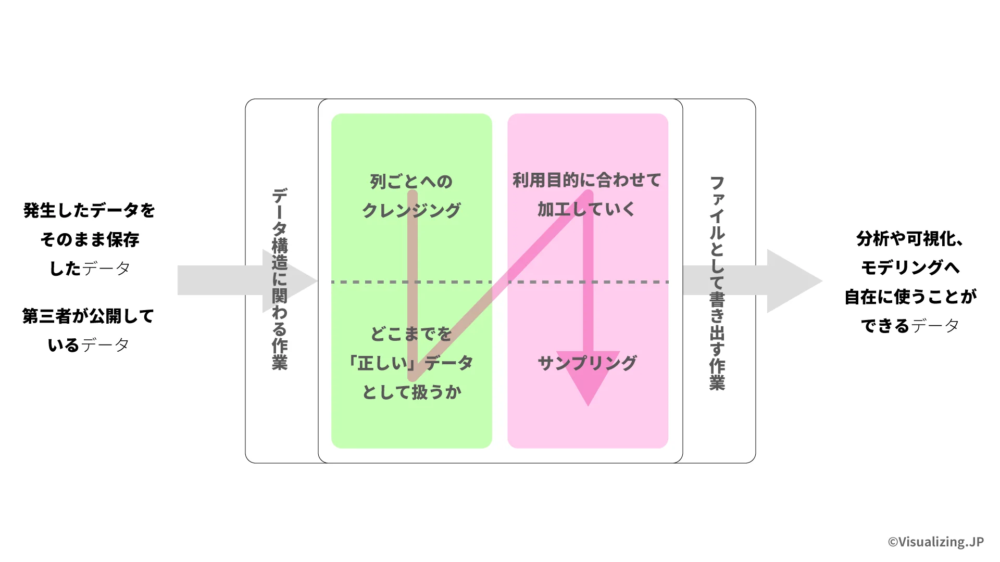
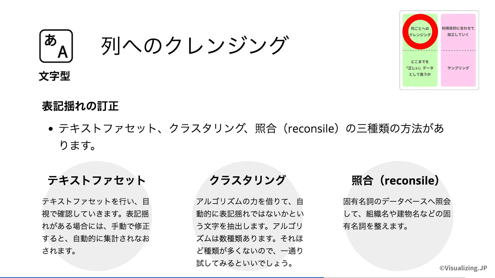

+++
author = "Yuichi Yazaki"
title = "Udemyコース：データをキレイにする技術"
subtitle = ""
slug = "udemy-data-cleaning"
date = "2025-10-19"
categories = [
    "video-on-demand"
]
tags = [
]
image = "images/thumb-udemy-data-cleaning.png"
+++

無料ツールOpen Refineを利用したデータクレンジングの実践をどなたにでも。

[データをキレイにする技術 | Udemy](https://www.udemy.com/course/dvl-datarefine-openrefine/?referralCode=00041ED9C10D92C22BCF)

## 本コースは、どんな内容か

- Open Refineというオープンソースで無料のウェブアプリケーションを使用して「データをキレイにする」ための方法論と具体的な手法をご紹介します。
- 全般的にマウスでの操作になりますが、一部、スクリプトとよばれる一行単位で完結するような短めのプログラミング言語を使う場面もあります。
- データがキレイになった結果として、可視化や分析に用いるツールの幅を広げ、打ち手を増やしていくことが可能になります。
- 「データをキレイにする」ことがテーマであり、データ取得やデータ可視化については扱っていません（話の流れで登場している箇所はあります）。それらについては今後別のコースとしてリリースしていきます。

## 何を学びますか？

- データ取得とデータ可視化・分析の間にある、これまでなかなか一般向けに言語化されてこなかった、データをキレイにする行為。
- データ可視化をするための最低限の条件であるデータの状態とは何であるかが学べます。
- 無料ツールOpen Refineを用いたデータをキレイにするための実際のやり方を学びます。
- 実際公開されている公的なデータを用いて、クレンジングや整形をハンズオンで画面を見ながらやり方を学べます。

## コース受講の必須条件または前提条件はありますか？

- Excelを使ったことがある方。
- パソコンをお持ちの方。

## このコースの対象受講者
- プログラマーでなくデータ分析の専門でもない一般の方。
- 効率よくデータを活用したい方。
- 普段Excelを使っていて、他のツールも使ってステップアップしたい方。

